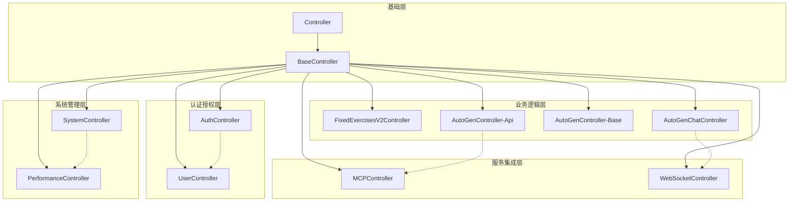

# 控制器架构文档

**创建时间**: 2025-01-27 21:10:00  
**文档版本**: v1.0.0  
**维护团队**: API 开发团队  
**适用范围**: Laravel 控制器层设计与实现  

---

## 📋 概述

控制器层是 HTTP 请求的直接处理者，负责接收请求、调用业务服务、返回响应。本目录包含了系统所有的控制器实现，按功能和职责进行分类组织。

---

## 🏗️ 控制器分类

### 🔥 核心 API 控制器 (`Api/`)

#### 🤖 AutoGen 系列控制器

**AutoGenController.php** (18.8KB - 核心组件)
- **职责**: AutoGen AI 系统主控制器
- **功能范围**: 
  - Agent 协作管理
  - 多 Agent 工作流控制
  - 训练计划生成 API
  - MCP 服务集成管理
- **复杂度**: 高 - 处理复杂的 AI 协作逻辑

**AutoGenChatController.php** (8.0KB)
- **职责**: AutoGen 聊天专用控制器
- **功能范围**:
  - 实时聊天会话管理
  - 聊天消息处理
  - 会话历史记录
  - WebSocket 集成支持
- **复杂度**: 中等 - 专注聊天功能

#### 🏋️ 健身业务控制器

**FixedExercisesV2Controller.php** (44.3KB - 最大组件)
- **职责**: 健身动作库管理系统
- **功能范围**:
  - 1,600+ 健身动作数据管理
  - 动作分类和筛选
  - 肌肉群映射算法
  - 智能动作推荐
  - 动作数据统计分析
- **复杂度**: 极高 - 最复杂的业务控制器
- **数据规模**: 处理大量健身动作数据

#### 🔗 服务集成控制器

**MCPController.php** (41.8KB - 核心基础设施)
- **职责**: MCP 服务器代理和管理
- **功能范围**:
  - 6个 MCP 服务器连接管理
  - MCP 工具调用代理
  - 服务器健康监控
  - 数据格式转换和验证
  - 错误处理和重试机制
- **复杂度**: 极高 - 系统基础设施级组件

#### ⚙️ 系统管理控制器

**SystemController.php** (17.9KB)
- **职责**: 系统监控和管理
- **功能范围**:
  - 系统健康状态检查
  - 服务可用性监控
  - 性能指标收集
  - 系统配置管理
  - 诊断信息提供
- **复杂度**: 中高 - 系统级操作

**WebSocketController.php** (11.3KB)
- **职责**: WebSocket 连接管理
- **功能范围**:
  - 实时连接建立
  - 消息广播机制
  - 连接状态管理
  - 用户在线状态跟踪
- **复杂度**: 中等 - 实时通信管理

### 🏠 基础控制器层

#### 🔧 基础架构控制器

**BaseController.php** (10.4KB - 架构基础)
- **职责**: 所有控制器的基类
- **核心功能**:
  - 统一 API 响应格式
  - 通用异常处理机制
  - 标准化日志记录
  - 基础权限检查框架
  - 性能监控集成点
- **设计模式**: 模板方法模式
- **重要性**: 极高 - 架构稳定性基础

**Controller.php** (0.3KB)
- **职责**: Laravel 框架控制器基类
- **说明**: 框架默认基类，保持简洁

#### 👤 用户管理控制器

**AuthController.php** (11.4KB)
- **职责**: 用户认证和授权管理
- **功能范围**:
  - 用户注册/登录/登出
  - JWT Token 管理
  - 密码重置流程
  - 双因子认证支持
  - 权限角色验证
- **安全级别**: 极高

**UserController.php** (11.9KB)
- **职责**: 用户信息管理
- **功能范围**:
  - 用户资料 CRUD 操作
  - 用户偏好设置管理
  - 账户安全设置
  - 用户活动记录
  - 头像上传管理
- **复杂度**: 中等

#### 📊 监控控制器

**PerformanceController.php** (19.3KB - 专业监控)
- **职责**: 系统性能监控专用控制器
- **功能范围**:
  - 实时性能数据收集
  - 性能指标分析和报告
  - 性能瓶颈识别
  - 优化建议生成
  - 性能历史数据管理
- **技术复杂度**: 高
- **业务价值**: 极高 - 系统稳定性保障

#### 🤖 AI 基础控制器

**AutoGenController.php** (11.2KB - 基础版本)
- **职责**: AutoGen 系统基础控制器
- **功能范围**:
  - 基础 Agent 管理
  - 简单消息处理
  - 会话状态管理
  - 基础 MCP 集成
- **说明**: 与 Api/AutoGenController.php 互补

---

## 📊 控制器规模分析

### 📈 代码规模排序

| 控制器 | 文件大小 | 复杂度 | 核心程度 | 维护优先级 |
|--------|----------|--------|----------|------------|
| FixedExercisesV2Controller | 44.3KB | ⭐⭐⭐⭐⭐ | 业务核心 | 🔥 极高 |
| MCPController | 41.8KB | ⭐⭐⭐⭐⭐ | 基础设施 | 🔥 极高 |
| PerformanceController | 19.3KB | ⭐⭐⭐⭐ | 系统监控 | 🔥 高 |
| AutoGenController (Api) | 18.8KB | ⭐⭐⭐⭐⭐ | AI核心 | 🔥 极高 |
| SystemController | 17.9KB | ⭐⭐⭐ | 系统管理 | ⚡ 中高 |
| UserController | 11.9KB | ⭐⭐⭐ | 用户管理 | ⚡ 中 |
| AuthController | 11.4KB | ⭐⭐⭐⭐ | 安全认证 | 🔥 高 |
| WebSocketController | 11.3KB | ⭐⭐⭐ | 实时通信 | ⚡ 中 |
| AutoGenController (基础) | 11.2KB | ⭐⭐⭐ | AI基础 | ⚡ 中 |
| BaseController | 10.4KB | ⭐⭐⭐⭐⭐ | 架构基础 | 🔥 极高 |
| AutoGenChatController | 8.0KB | ⭐⭐ | 聊天功能 | ⚡ 中 |

### 🎯 关键发现

1. **业务复杂度极高**: FixedExercisesV2Controller 和 MCPController 都超过 40KB，表明业务逻辑复杂
2. **AI 系统完善**: 多个 AutoGen 控制器显示 AI 功能完整
3. **监控系统专业**: PerformanceController 19.3KB 显示监控功能专业
4. **架构设计良好**: BaseController 作为基础提供统一框架

---

## 🔗 控制器依赖关系



---

## 🚀 技术特性分析

### 💡 设计模式应用

1. **模板方法模式**: BaseController 定义通用处理流程
2. **策略模式**: 不同 AutoGen 控制器实现不同策略
3. **代理模式**: MCPController 作为 MCP 服务代理
4. **观察者模式**: PerformanceController 监控系统状态

### 🔧 架构优势

1. **职责分离**: 每个控制器职责明确，边界清晰
2. **可扩展性**: 基于 BaseController 易于扩展新控制器
3. **复用性**: 公共功能在基类中实现
4. **维护性**: 分层架构便于维护和测试

### ⚡ 性能特性

1. **异步处理**: WebSocket 支持实时通信
2. **缓存集成**: 通过中间件支持响应缓存
3. **监控完善**: 专业的性能监控控制器
4. **优化机制**: 自动性能优化集成

---

## 📋 开发规范

### 🔧 控制器开发标准

```php
<?php

namespace App\Http\Controllers\Api;

use App\Http\Controllers\BaseController;
use App\Http\Requests\CustomRequest;
use App\Services\CustomService;
use Illuminate\Http\JsonResponse;

class CustomController extends BaseController
{
    protected CustomService $customService;
    
    public function __construct(CustomService $customService)
    {
        $this->customService = $customService;
    }
    
    /**
     * 处理业务请求
     */
    public function index(CustomRequest $request): JsonResponse
    {
        try {
            $data = $this->customService->process($request->validated());
            return $this->successResponse($data, '操作成功');
        } catch (Exception $e) {
            return $this->errorResponse($e->getMessage(), 500);
        }
    }
}
```

### 📏 代码质量标准

1. **方法长度**: 单个方法不超过 50 行
2. **类复杂度**: 圈复杂度 < 10
3. **依赖注入**: 优先使用构造函数注入
4. **异常处理**: 必须有完善的异常处理
5. **文档注释**: 每个方法必须有文档注释

### 🧪 测试要求

1. **单元测试**: 每个方法都要有对应测试
2. **集成测试**: API 端点要有集成测试
3. **覆盖率**: 测试覆盖率 > 80%
4. **边界测试**: 包含边界条件和异常情况

---

## 🔍 问题分析和建议

### ⚠️ 潜在问题

1. **代码规模过大**: FixedExercisesV2Controller (44.3KB) 可能需要拆分
2. **职责重叠**: 两个 AutoGenController 可能存在功能重复
3. **维护难度**: 超大控制器的维护复杂度较高

### 💡 优化建议

1. **控制器拆分**: 将大型控制器按功能拆分为多个小控制器
2. **服务层优化**: 将复杂业务逻辑迁移到服务层
3. **接口标准化**: 统一 API 响应格式和错误处理
4. **文档完善**: 为复杂控制器添加详细文档

### 🚀 架构改进

1. **引入 Resource Controllers**: 标准化 CRUD 操作
2. **实现 API Versioning**: 支持 API 版本管理
3. **添加 Rate Limiting**: 在控制器级别实现频率限制
4. **集成 Caching**: 为读操作添加缓存支持

---

**维护团队**: API 开发组  
**文档状态**: ✅ 已完成  
**技术债务**: 需要拆分超大控制器  
**下次审查**: 2025-02-27