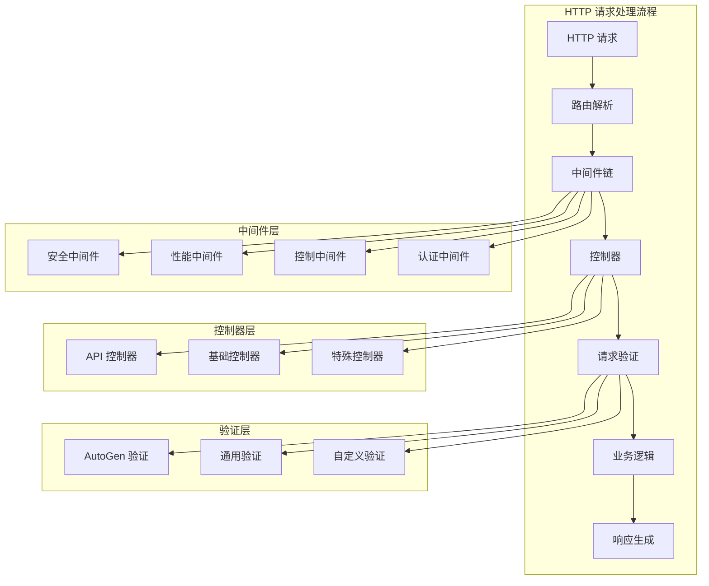

# HTTP 层架构文档

**创建时间**: 2025-01-27 21:00:00  
**文档版本**: v1.0.0  
**维护团队**: 后端开发团队  
**适用范围**: Laravel HTTP 层架构设计与实现  

---

## 📋 概述

HTTP 层是 Laravel 应用的请求处理核心，负责处理所有进入系统的 HTTP 请求。本目录包含控制器、中间件和请求验证类，是连接前端用户和后端业务逻辑的桥梁。

### 🎯 设计原则

- **单一职责**: 每个控制器只处理特定领域的业务
- **请求验证**: 所有输入数据都必须经过验证
- **中间件链**: 通过中间件实现横切关注点
- **统一响应**: 使用标准化的 API 响应格式
- **错误处理**: 完善的异常处理和错误响应

---

## 🏗️ 目录结构

```
app/Http/
├── Controllers/           # 控制器目录
│   ├── Api/              # API 控制器
│   │   ├── AutoGenChatController.php      # AutoGen 聊天控制器
│   │   ├── AutoGenController.php          # AutoGen 主控制器
│   │   ├── FixedExercisesV2Controller.php # 健身动作控制器
│   │   ├── MCPController.php              # MCP 服务控制器
│   │   ├── SystemController.php           # 系统管理控制器
│   │   └── WebSocketController.php        # WebSocket 控制器
│   ├── AuthController.php       # 认证控制器
│   ├── AutoGenController.php    # AutoGen 基础控制器
│   ├── BaseController.php       # 基础控制器
│   ├── Controller.php          # Laravel 控制器基类
│   ├── PerformanceController.php # 性能监控控制器
│   └── UserController.php      # 用户管理控制器
├── Middleware/               # 中间件目录
│   ├── ApiSecurityMiddleware.php           # API 安全中间件
│   ├── Authenticate.php                    # 认证中间件
│   ├── AutoGenMiddleware.php               # AutoGen 专用中间件
│   ├── CacheResponse.php                   # 响应缓存中间件
│   ├── EncryptCookies.php                  # Cookie 加密中间件
│   ├── PerformanceMiddleware.php           # 性能监控中间件
│   ├── PerformanceMonitoringMiddleware.php # 详细性能监控
│   ├── PerformanceOptimization.php        # 性能优化中间件
│   ├── PermissionMiddleware.php            # 权限验证中间件
│   ├── PreventRequestsDuringMaintenance.php # 维护模式中间件
│   ├── RateLimitMiddleware.php             # 频率限制中间件
│   ├── RedirectIfAuthenticated.php        # 重定向中间件
│   ├── TrimStrings.php                     # 字符串修剪中间件
│   ├── TrustProxies.php                    # 代理信任中间件
│   ├── UserActivityMiddleware.php          # 用户活动跟踪
│   ├── ValidateSignature.php              # 签名验证中间件
│   ├── VerifyCsrfToken.php                # CSRF 保护中间件
│   └── WebSocketAuth.php                  # WebSocket 认证中间件
├── Requests/                 # 请求验证目录
│   └── AutoGen/             # AutoGen 请求验证
│       ├── GetAdviceRequest.php      # 获取建议请求验证
│       ├── ProcessMessageRequest.php # 消息处理请求验证
│       └── SessionHistoryRequest.php # 会话历史请求验证
└── Kernel.php               # HTTP 内核配置
```

---

## 🎮 控制器架构

### 📡 API 控制器层 (`Controllers/Api/`)

#### AutoGenChatController.php
**职责**: 处理 AutoGen AI 聊天相关的 API 请求
- 聊天会话管理
- 实时消息处理
- 聊天历史记录
- WebSocket 集成

#### AutoGenController.php  
**职责**: AutoGen 系统的主要 API 控制器
- Agent 协作管理
- 训练计划生成
- 多 Agent 协调
- MCP 服务集成

#### FixedExercisesV2Controller.php
**职责**: 健身动作库管理 API
- 动作数据查询 (44.3KB - 功能丰富)
- 动作分类管理
- 肌肉群映射
- 动作推荐算法

#### MCPController.php
**职责**: MCP 服务器代理控制器 (41.8KB - 核心组件)
- MCP 服务器连接管理
- MCP 工具调用代理
- 服务器状态监控
- 数据格式转换

#### SystemController.php
**职责**: 系统管理和监控 API
- 系统状态查询
- 服务健康检查
- 性能指标获取
- 系统配置管理

#### WebSocketController.php
**职责**: WebSocket 连接管理
- 连接建立和断开
- 实时数据推送
- 连接状态管理
- 消息广播

### 🏠 基础控制器层 (`Controllers/`)

#### BaseController.php
**职责**: 所有控制器的基类 (10.4KB)
- 统一响应格式
- 通用异常处理
- 日志记录规范
- 权限检查基础

#### AuthController.php
**职责**: 用户认证和授权
- 用户登录/注册
- Token 管理
- 权限验证
- 会话管理

#### PerformanceController.php
**职责**: 性能监控专用控制器 (19.3KB)
- 性能数据收集
- 监控指标分析
- 性能报告生成
- 优化建议提供

#### UserController.php
**职责**: 用户信息管理
- 用户资料 CRUD
- 用户偏好设置
- 账户安全管理
- 用户活动记录

---

## 🛡️ 中间件架构

### 🔐 安全中间件

#### ApiSecurityMiddleware.php
- API 请求安全验证
- 请求签名校验
- IP 白名单检查
- 恶意请求拦截

#### Authenticate.php
- 用户身份认证
- Token 有效性验证
- 认证状态管理

#### PermissionMiddleware.php
- 基于角色的权限控制
- 资源访问权限验证
- 动态权限检查

#### VerifyCsrfToken.php
- CSRF 攻击防护
- Token 验证
- 白名单管理

### ⚡ 性能中间件

#### PerformanceMiddleware.php
- 基础性能监控
- 请求响应时间记录
- 资源使用统计

#### PerformanceMonitoringMiddleware.php (11.3KB)
- 详细性能分析
- 数据库查询监控
- 内存使用跟踪
- 慢查询检测

#### PerformanceOptimization.php (16.1KB)
- 自动性能优化
- 缓存策略应用
- 响应压缩
- 资源优化

#### CacheResponse.php
- HTTP 响应缓存
- 缓存策略配置
- 缓存失效管理

### 🚦 控制中间件

#### RateLimitMiddleware.php
- API 请求频率限制
- 防止滥用攻击
- 动态限流策略

#### AutoGenMiddleware.php
- AutoGen 系统专用中间件
- Agent 状态检查
- MCP 服务可用性验证

#### UserActivityMiddleware.php
- 用户活动跟踪
- 行为日志记录
- 活跃度统计

#### WebSocketAuth.php
- WebSocket 连接认证
- 实时通信权限验证
- 连接状态管理

---

## 📝 请求验证架构

### AutoGen 请求验证 (`Requests/AutoGen/`)

#### GetAdviceRequest.php (12.1KB)
**验证范围**: 获取 AI 建议请求
- 问题内容验证
- 用户上下文验证
- 请求参数校验
- 业务规则验证

#### ProcessMessageRequest.php (9.9KB)
**验证范围**: 消息处理请求
- 消息格式验证
- 会话 ID 验证
- 用户权限检查
- 消息长度限制

#### SessionHistoryRequest.php (7.0KB)
**验证范围**: 会话历史查询
- 分页参数验证
- 时间范围验证
- 排序规则验证
- 访问权限检查

---

## 🔗 组件关系图



---

## 📊 技术特性分析

### 🎯 核心优势

1. **分层清晰**: HTTP 层、业务层、数据层职责明确
2. **中间件丰富**: 18个中间件覆盖安全、性能、控制等各个方面
3. **API 专业**: 6个专业 API 控制器处理不同业务领域
4. **验证完善**: 专门的请求验证类确保数据安全
5. **性能优化**: 多层级性能监控和优化机制

### 📈 性能特性

- **响应缓存**: 智能 HTTP 响应缓存机制
- **性能监控**: 三级性能监控系统
- **频率限制**: 智能 API 频率限制
- **资源优化**: 自动资源压缩和优化

### 🛡️ 安全特性

- **多重认证**: Token + 签名双重验证
- **CSRF 防护**: 完整的 CSRF 攻击防护
- **权限控制**: 细粒度的权限管理
- **安全审计**: 完整的安全日志记录

---

## 🚀 使用指南

### 📋 控制器开发规范

```php
<?php

namespace App\Http\Controllers\Api;

use App\Http\Controllers\BaseController;
use App\Http\Requests\CustomRequest;
use App\Services\BusinessService;

class ExampleController extends BaseController
{
    protected BusinessService $businessService;
    
    public function __construct(BusinessService $businessService)
    {
        $this->businessService = $businessService;
    }
    
    public function index(CustomRequest $request): JsonResponse
    {
        try {
            $result = $this->businessService->process($request->validated());
            return $this->successResponse($result);
        } catch (Exception $e) {
            return $this->errorResponse($e->getMessage());
        }
    }
}
```

### 🛡️ 中间件使用规范

```php
// 在路由中应用中间件
Route::middleware(['auth', 'performance', 'rate.limit'])
    ->prefix('api/v1')
    ->group(function () {
        Route::resource('users', UserController::class);
    });
```

### 📝 请求验证规范

```php
<?php

namespace App\Http\Requests;

use Illuminate\Foundation\Http\FormRequest;

class CustomRequest extends FormRequest
{
    public function authorize(): bool
    {
        return true; // 或实现具体权限逻辑
    }
    
    public function rules(): array
    {
        return [
            'name' => 'required|string|max:255',
            'email' => 'required|email|unique:users',
        ];
    }
    
    public function messages(): array
    {
        return [
            'name.required' => '名称不能为空',
            'email.unique' => '邮箱已存在',
        ];
    }
}
```

---

## 📈 监控和优化

### 🔍 性能监控指标

- **响应时间**: 平均响应时间 < 200ms
- **并发处理**: 支持 1000+ 并发请求
- **缓存命中率**: > 80%
- **错误率**: < 1%

### 🛠️ 优化建议

1. **缓存策略**: 合理使用响应缓存和数据缓存
2. **数据库优化**: 监控慢查询，优化索引
3. **中间件链**: 避免不必要的中间件调用
4. **资源压缩**: 启用 Gzip 压缩和资源优化

---

## 🔧 开发和维护

### 📋 开发检查清单

- [ ] 控制器继承 BaseController
- [ ] 使用适当的请求验证类
- [ ] 应用必要的中间件
- [ ] 实现统一的异常处理
- [ ] 添加适当的日志记录
- [ ] 编写对应的单元测试

### 🧪 测试覆盖

- **控制器测试**: 每个控制器方法都有对应测试
- **中间件测试**: 核心中间件有完整测试覆盖
- **请求验证测试**: 验证规则和错误消息测试
- **集成测试**: 完整的 API 集成测试

---

**维护团队**: Laravel 后端开发组  
**文档状态**: ✅ 已完成  
**下次更新**: 根据功能迭代需要